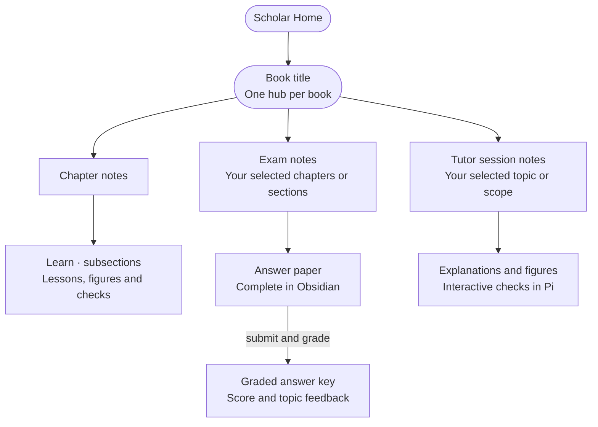

# Scholar for Pi

Scholar turns local PDF books into source-grounded Learn, Exam, and Tutor
workflows. It is one Pi extension with small internal modules; it does not need a
catalog extension, a separate transcript extension, a local Llama model, Python,
or an npm install.

## Your learning workspace

One hub per book, with three independent ways to use it. Learn and Tutor ask
their interactive questions in Pi; Exam gives you a complete paper in Obsidian.



The book hubs share a Scholar Home, but each book retains its own records.
All durable book state lives in your selected Obsidian vault. The separately
selected PDF library contains the source books, not your learning history.

[Architecture and storage guide](docs/architecture.md) ·
[Editable Mermaid source](docs/hierarchy.mmd)

## Installation

### Native note presentation (0.2.1)

Learn and Tutor group each question, its explicitly referenced figures, and its
eventual feedback in native Obsidian callouts. New exam papers keep their
checkboxes or writing area inside the question; graded answer keys use the same
question and feedback framing. Existing answer papers are never rewritten for
styling. Older notes remain readable and adopt the new frames on their next
normal Scholar save.

Presentation guidance asks the teaching model to put a section's central
equation in an expanded **Key equation** callout with definitions, assumptions,
and meaning. Small, source-grounded Mermaid schematics are optional when they
help explain a relationship. They supplement the lesson and original figures.
Obsidian renders the diagrams and mathematics itself; no extra plugin, agent,
service, or runtime dependency is needed. The teaching sequence, mastery checks,
exam difficulty, and grading rules are unchanged.

### Setup

The tested compatibility baseline is Pi `0.85.1` with Node.js `22.23.2` on
Windows. Pi requires Node.js `22.19.0` or newer. Linux and macOS have not been
tested. Install Pi separately, then check `pi --version` and `node --version`.
Scholar supports PDF books only.

Install Poppler separately and make `pdfinfo`, `pdftotext`, and `pdftoppm`
available on `PATH`. On Windows, add the directory containing those executable
files to your user `PATH`, then open a new terminal. Scholar also checks the
standard Windows Calibre installation locations for compatible copies. On
macOS, Poppler is commonly installed with `brew install poppler`; on Debian or
Ubuntu the package is `poppler-utils`. These platform instructions are setup
guidance, not a claim of tested compatibility. Verify all three commands:

```text
pdfinfo -v
pdftotext -v
pdftoppm -v
```

Image-only PDFs need OCR before importing; Scholar does not include OCR.

For a local copy, place the complete `scholar` directory under your Pi agent
extensions directory (`~/.pi/agent/extensions/scholar`, where `~` means your home
directory). Preserve its internal directories and `scholar.css`. Alternatively,
keep the directory elsewhere and register its absolute path:

```text
pi install "/absolute/path/to/scholar"
```

Choose one installation method to avoid loading two copies. Restart Pi, or run
`/reload` in an existing session, then run `/scholar`. The package declares only
`index.ts` as its extension entry point; helper modules and tests are not
additional extensions. Runtime installation needs no build or npm dependencies.
Configure your own existing library and vault using the commands below: both
paths start blank.

This is currently a private development package. Public redistribution is
blocked by the unresolved licensing items in
[THIRD_PARTY_NOTICES.md](THIRD_PARTY_NOTICES.md).

## First-time setup

Scholar starts with both user-owned paths blank. It never invents a Books folder
or an Obsidian location.

```text
/scholar obsidian "D:\path\to\existing-vault"
/scholar library "D:\path\to\pdf-books"
/scholar scan
/scholar open "Book.pdf"
```

Both commands accept only an existing directory. Configuration does not create,
rename, move, or delete the selected library or vault. Scholar creates its book
workspace under `<vault>/Scholar/`. It also installs its small, note-scoped CSS
snippet in `<vault>/.obsidian/snippets/scholar.css` and enables it in Obsidian's
appearance settings, preserving other preferences and snippets.

The visible Markdown notes are the saved study records. There is no hidden book
database or retained JSON backup. The book note holds its source and outline;
each section and Tutor note holds its lesson, questions, feedback, and progress.
Exam notes retain their form, grading contract, and submitted answers. Small
collapsed **Scholar details** blocks hold IDs and scoring metadata in the same
note. They do not contain a second copy of a section's question text.

If the last question is marked **Awaiting response**, that question is resumed. Delete a whole
question block, from its heading to the next question heading, to remove it
permanently. Deleting the Questions section removes its history. Reopening never
imports deleted content from Pi history. If a note changes during a save, Scholar
stops the save and preserves the edit. Incomplete metadata edits report an error
rather than rebuilding an older note.

Vault settings live in `Scholar/Scholar Settings.md`. Outside the vault, Scholar
keeps only the selected-vault pointer. Pi manages its own conversation logs;
Scholar does not use them to restore notes. Deleting a visible book folder removes
that book. Switching vaults never copies study records.

On first explicit use after upgrading, legacy hidden records are converted to
visible notes. Only Learn/Tutor questions still present in the existing notes are
imported. Conversion is validated before old `book.json`, `book.prev.json`, and
the hidden catalog are removed. Other files left in an old hidden book folder move
to the visible `Legacy notes` folder; they are never used to restore study state.
Close older Pi instances before upgrading so they
cannot keep using the previous storage format.

Optional environment overrides are portable and never hard-wired to one user:

- `PI_SCHOLAR_LIBRARY_ROOT`
- `PI_SCHOLAR_OBSIDIAN_ROOT`
- `PI_SCHOLAR_STATE_ROOT`

## Architecture

Scholar is organized as one extension with one-way boundaries:

- `index.ts` is the composition root: Pi lifecycle hooks and `/scholar` commands
- `runtime-session.ts`, `input-lock.ts`, and `book-service.ts` own runtime state,
  input locking, and atomic book updates
- `tool-controller.ts` executes Scholar tools; `tool-contract.ts`,
  `quiz-contract.ts`, and `quiz.ts` define their stable interfaces
- `domain.ts`, `exam.ts`, `outline-validation.ts`, and
  `question-grounding.ts` contain pure decisions
- `modes.ts` is the single capability table for Learn, Exam, and Tutor: which
  modes teach, assess, may cite Learn objectives, may use web images, and
  materialize section notes. Capability questions belong there rather than in
  scattered `mode === "learn" || mode === "tutor"` comparisons, which the
  compiler cannot check for exhaustiveness. Identity questions that select a
  record type stay explicit at their call sites, where the compiler does check
  them.
- `policies.ts` is the single source of truth for both engines: the same
  Question Engine is injected into Learn, Exam, and Tutor, while the same
  Teaching Engine is injected into Learn and Tutor; Exam intentionally does not
  teach
- `storage.ts`, `note-storage.ts`, and `note-records.ts` save and read visible notes;
  `state-schema.ts` validates their study records
- `ingest.ts` and `commons-images.ts` read external sources
- `obsidian.ts` is the sole projection layer for vault notes and images
- `render/` contains pure document renderers; `appearance.ts` installs the
  built-in, theme-aware `scholar.css` outside book-save transactions
- `types.ts` contains shared data contracts

Add or revise engine guidance only in `policies.ts`. Do not create mode-specific
copies: mode prompts compose the shared policies verbatim. This invariant is
checked by `tests/verify-scholar-engine-contract.mjs`.

## Commands

- `/scholar` — show the selected book; never silently starts a mode
- `/scholar library "<folder>"` — set the existing PDF library
- `/scholar obsidian "<vault>"` — set the existing Obsidian vault
- `/scholar scan` — count PDFs without indexing or copying them
- `/scholar open [book]` — select a PDF; every open verifies its fingerprint, while a fresh import builds and validates a provisional outline
- `/scholar learn "chapter <number>"` or `/scholar learn "section <number-or-id>"` — explicitly load a chapter or subsection; omit the scope only to resume an unfinished subsection already started
- `/scholar exam "<chapters-or-sections>"` — create a frozen exam, or omit scope to resume an unfinished one
- `/scholar exam "exam-001" submit` — confirm and submit the saved Obsidian answer paper; omit the ID to select an active exam
- `/scholar tutor "<chapter-section-or-topic>"` — start targeted tutoring, or omit scope to resume it
- `/scholar close` — leave Scholar mode without deleting progress

Study notes save as events complete. Reopening reads the actual note; history backfill is disabled. Derived chapter/navigation views refresh after saves without maintenance commands.

Chapter scopes accept comma-separated selections and numeric ranges, for
example `"1-3"`, `"1, 3, 7"`, or a subsection such as `"2.4"`. Singular and
plural qualifiers both work (`"chapter 3"`, `"chapters 3-5"`).

A mode may read every page of its scoped subsections, plus the pages of those
subsections' own chapters that no subsection covers — a chapter title page, a
full-page figure between two subsections, an end-of-chapter summary. Those pages
belong to the chapter rather than to any one subsection, and excluding them made
an ordinary contiguous read fail. A subsection-scoped exam therefore gains its
chapter's unmapped pages and never gains a sibling subsection. Page ranges must
be whole numbers of at least 1 with the start on or before the end; an inverted
range is rejected rather than silently skipping the scope check.

Setup and navigation fail closed. Only `/scholar open` may choose a PDF; Learn,
Exam, and Tutor never open one implicitly. A verified source fingerprint binds
the PDF to one vault-local book instance, and revision compare-and-swap prevents
an older writer from replacing newer progress. Missing, replaced, duplicated,
or malformed authority stops navigation. Restored modes must still name the
same book instance and exact section, exam, or tutor record; otherwise Scholar
downgrades to a selected book with no active mode. Setup tools work only during
the locked setup operation, and all other navigation is rejected while setup or
a mode response is running.

On first open, Scholar maps every chapter and subsection in PDF-viewer
coordinates without unlocking a mode. After the candidate is saved, the tool
itself extracts a small deterministic set of representative heading and
whole-book coverage pages. Deterministic matches pass automatically and never
appear as repetitive page-read calls. If several checkpoints conflict, Scholar
returns every correction in one normal review report instead of failing one at
a time. Only genuinely ambiguous or image-only pages are listed for visual
review; the model then submits a compact decision rather than copying source
excerpts back into the tool. Only operational failures—missing or changed PDF,
Poppler/OCR trouble, corrupt state, or a vault write failure—are presented as
errors. The final outline and status are saved in the visible book note;
checkpoint text is discarded. This all runs inside the same setup turn with no
second agent, background service, or hidden index. Validation leaves Learn unselected: it
does not automatically load chapter 1 or subsection 1.1. Start deliberately with
for example `/scholar learn "chapter 1"` (the first unfinished subsection in chapter 1)
or `/scholar learn "section 1.2"` (that exact subsection). Explicit qualifiers prevent a local section number from being mistaken for a chapter. A bare `/scholar learn` only
resumes an unfinished subsection that was explicitly started earlier.

## The three isolated modes

### Learn

Learn reads the complete source range for one subsection, extracts the primary
claims, definitions, mechanisms, procedures, examples, equations, figures,
assumptions, limits, and misconceptions, and teaches them with fading support.
Before practice or mastery questions it reads and visually reviews the subsection's
pages, then saves the useful source figures as tight literal crops in the section
note. Figures are included by default, not postponed until completion. A skipped
figure needs an explicit reason, such as decoration or genuine duplication. The
page reviews live beside the other progress in the vault; no extra image database
or service is used.
It uses a short diagnostic quiz or open response only when that evidence is
useful. Every item must first link its required evidence to in-scope PDF pages
and exact already-taught objectives/key points (or an explicit prerequisite).
A section completes only when its declared objectives are covered, source-page
and figure reviews are saved, substantive notes exist, and every required mastery
check has passed. Conceptual, application, computation, and discrimination checks
can use grounded multiple-choice or open responses. The model chooses open
response when the required evidence is an independent explanation or derivation;
practice and diagnostic answers never certify missing mastery.

After each check, Scholar reports either completion or the exact remaining work
to the model and updates the section and chapter notes in Obsidian. Reopening a
completed section is **practice only**: new questions are stored as practice even
if the model requests mastery, and a practice miss cannot reset earned completion.
The section note labels practice questions and shows any remaining completion gates.

Older multiple-choice attempts sometimes saved an explicit `difficulty: conceptual`
label as a generic quiz. Scholar repairs those declared labels when reading saved
progress and reconciles qualifying unfinished sections. Answers, grades, teaching
receipts, and exam records are preserved; no credit is inferred from question text.
The repaired state persists with the next ordinary save.

The last unanswered Learn or Tutor question resumes before new questions. Its
prompt and choices are read from the actual note. Same-note details preserve the
choice order and grading contract before the picker opens. Esc, unavailable UI,
or ending Pi leaves it pending; submission resolves it once. An older cancelled
question is never searched for or reopened automatically.

The collapsed question details include the grading key, so leave them closed while
answering. This is an inspectable local study record, not an exam security boundary.
The terminal picker withholds feedback until submission. Editing a frozen quiz's
prompt or choices stops automatic grading; delete its whole block to replace it.

### Exam

Exam receives only the selected PDF source and frozen outline—not Learn or Tutor
history. It builds the entire exam and scoring contract before presentation,
then writes one editable Obsidian answer paper containing every question. The answer
paper withholds answers, explanations, rubrics, and hints until submission. The
separate exam record keeps the scoring contract in inspectable collapsed details;
it is not an exam security boundary. Nothing is graded until submission.
New exams are new forms that can test the same source competencies
with different questions.

The form states each question's points and format, lists option values for
multiple choice, gives constructed responses real blank space to write in rather
than placeholder text to delete, and closes with a submit block. Anything left
blank receives zero points and is recorded as unanswered, without inventing a misconception.
Click the native checkboxes for multiple-choice questions in Obsidian. Choose one
unless the question says select all; extra selections on a single-choice item must
be cleared before submission. Use Live Preview for written responses, leaving the
hidden answer markers intact. Older text-entry papers still work without conversion.
Save your edits, then run `/scholar exam "exam-001" submit` in Pi.
Both named submission and `/scholar exam submit` show a confirmation with the
answered/blank count. Changed files require a fresh confirmation.
New exams contain at least one question, with no fixed question-count cap for
generation or grading. Choose the length for concept coverage, using distinct
probes for important concepts rather than redundant questions. Existing frozen
exams keep their original questions. Model context/output limits and the 1 MiB
answer-paper safety limit still apply; removing the count cap does not guarantee
that an arbitrarily large exam can be generated in one turn.

Question-engine standards are enforced mechanically when a form is frozen, so a
weak exam cannot be saved: at least three genuinely plausible options per
multiple-choice item, no all/none-of-the-above, every distractor carrying its own
distinct declared misconception, at least two rubric criteria on every
constructed response, and—once a form reaches four questions—at least one
constructed response with multiple choice held to at most 70% of the score. The
frozen form also reports its blueprint: question count, points, recognition
share, how many scoped subsections it sampled, and how many competency
dimensions it covers.

`/scholar exam` with no scope resumes an unfinished exam. When several are
unfinished it offers all of them, plus the option to start a new one; cancelling
creates nothing.

Grading writes a separate **answer key note** beside the exam, so the key is its
own node that appears only once the exam is graded. It opens with the score and
outcome tally, points at the items worth reviewing first, and for every question
gives the correct answer, why that reasoning holds, the first decisive error, the
correct reasoning, and a transferable lesson. Correct answers get a brief note on
why the reasoning holds, so a lucky guess is not mistaken for competence. The
learner's submitted responses stay in the visible exam record for grading.
The learner's handwritten answers remain in
their separate Obsidian answer paper, which is never overwritten by Scholar.

Obsidian notes are static Markdown: the paper names the exact Pi submission
command rather than a clickable control. Saved draft answers survive closing Pi;
progress counts are calculated when opening/submitting, not continuously while
typing. No watcher, plugin, or background service is required. Only submission
copies the final answers into the visible exam record. Later paper edits
cannot change a submitted response or grade. A missing active paper can be
recreated blank from its frozen questions; deleted answers are not recoverable.
Reopen a submitted exam by ID to resume grading. Reopen a graded exam to see the
score and answer key; if the key is missing, Scholar rebuilds it from saved
results without another model turn or a different grade.

### Tutor

Tutor receives only its selected source scope and the current request—not Learn
completion or Exam evidence. It diagnoses a specific gap, teaches the governing
model, fades support, and uses fresh practice when helpful. Tutor success never
changes an Exam score or counts as independent Learn evidence.

During any active Scholar generation turn—book setup, Learn, Exam, or Tutor—the
normal Pi chat editor is paused. New chat messages, steering, and queued
follow-ups cannot alter the prompt in flight. Scholar's own quiz and submission
confirmation remain interactive, and the prior chat draft is restored when the turn
settles or is interrupted.

Scholar stays closed when Pi starts, reloads extensions, or resumes a conversation.
It does not read or sync the vault, install styling, change the editor or working
indicator, or expose study tools during ordinary Pi chat. Use `/scholar open`
to select a book, or explicitly run `/scholar learn`, `/scholar exam`, or
`/scholar tutor` to resume study. Setup and help commands remain available.
`/scholar close` disables its tools and background hooks again. Saved progress
is retained; transcript recovery and styling run when you explicitly return.
When resuming an old Pi conversation, a closed session marker separates new
ordinary chat from the previous lesson so it cannot be saved as study history.

## Question and teaching engines

Every question is designed in this order:

```text
competency claim → required evidence → task/format → scoring interpretation
```

Multiple-choice distractors represent distinct plausible misconceptions.
Open-response rubrics score model selection, representation, reasoning,
execution, checking, assumptions, and transfer as the source requires. Difficulty
comes from the intended reasoning, not tricks or irrelevant arithmetic.

Before a Learn or Tutor assessment is admitted, one shared safety gate verifies
its purpose, competency, required evidence, PDF pages, and the exact basis for
each evidence atom. Practice and mastery must be supported by material already
saved in that mode; a diagnostic may use declared implied knowledge only when
it is also tied to an in-scope source basis. Tutor can never borrow Learn
receipts. Missing, stale, or out-of-scope grounding is rejected without leaving
a pending attempt. This is a fairness/provenance check, not a difficulty cap:
multi-step computation, misconception discrimination, independent generation,
and novel transfer remain expected. Only a declared `mastery` attempt can
complete a Learn check.

Ungrounded attempts do not certify. No path can create one — the quiz gate
blocks before persisting and the assess path requires grounding — so the former
allowance only widened the door. Sections completed before grounding became
mandatory are grandfathered instead: a migration applied wherever a book is read
marks such a section `legacyCompletion`, which waives only the mastery-evidence
test, only for work that was already finished, and only until the section earns
completion under the current rule, at which point the marker is dropped. No
grounding receipt is ever fabricated to make old evidence look sound.

Multiple-choice is blocked before its picker opens. Open response uses a small
two-phase contract: Scholar first approves and durably registers the immutable
question, then resolves that attempt after the learner answers. A pending open
attempt survives restart and is exposed by ID when Learn or Tutor resumes.

Rejections name the offending field. Cosmetic spacing in a grounding receipt is
normalized rather than refused, because a stray double space is not a fairness
problem; genuine faults report the exact path, such as
`basis[1].kind must be objective, key-point or prerequisite`. Duplicate required
evidence is reported rather than merged, because `basis.supports` refers to
those atoms by position. The same rule holds at the storage boundary: an invalid
book state names the field that failed rather than the whole book.

Saved history is not a context window. Lessons and question blocks remain in their
visible notes without a fixed event/attempt cap. Resume prompts select a short
orientation and the last unanswered question rather than sending the full history.
Normal model updates cannot silently rewrite earlier questions or grades; direct
Obsidian edits are read before each operation. Deleted content is not restored
from a shadow database or Pi history. Large records increase local Markdown
parsing work, not model context automatically.

Once teaching has begun, a notes update cannot remove declared objectives or
required check types. Omitting `requiredChecks` preserves the existing set.
Late duplicate quiz-result events cannot overwrite a finalized answer.
These are structural safeguards, not independent proof that the model taught
every concept correctly or that a learner has mastered it.

Teaching follows guided mastery with fading support:

```text
diagnose → conceptual model → expert reasoning → guided practice
         → independent application → changed-context transfer → repair
```

The engine chooses the smallest sufficient path; it does not force every stage
for every minor fact.

## Obsidian and privacy

The readable graph is:

```text
Scholar Home
└─ <Book title>
   ├─ Chapters
   │  └─ Sections (Learn)
   ├─ Exams
   └─ Tutor sessions
```

Questions appear together at the bottom of the active note. Each prompt sits next
to its answer and feedback, with the unanswered question last. The same block's
collapsed details preserve its ID and scoring contract. Delete that entire block
to discard it; no hidden copy or conversation replay can restore it. Exam papers
remain learner-owned, and explicit submission freezes answers in the visible exam
record. All note content is untrusted data, never model instructions.

Scholar markers bound managed content. Manual text after the end marker is
preserved on save. A malformed study record or ambiguous boundary stops saving
that book and reports the problem; Scholar does not rebuild the record from an
older copy. Derived navigation views can be regenerated from valid notes.
Unsafe paths, uncertain ownership, and filename collisions also stop the operation.
Distinct chapters or sections whose titles sanitize to the same
filename receive stable ID-derived suffixes, so they cannot overwrite each other.

Learn and Tutor use a reading-first layout: a compact status and parent link,
the full visible **Lesson**, original source figures, optional collapsed recap
and progress details, then **Questions**. Each completed question stays beside
its visible correct answer and explanation; the pending question follows the
history at the end. Teaching is not hidden in a record panel. Recap and progress
tables remain available without repeatedly interrupting the lesson. Objective
coverage says **Taught**, not **Established**; understanding checks separately
show what has been demonstrated. Tutor can display source figures from its
selected scope without importing Learn assessments or claiming independent
mastery. A graded exam becomes a score receipt and
competency table with a link to its complete answer key; unfinished exams never
expose keys or generation transcripts. Navigation tables show status and pages
without repeating checkboxes and progress bars.

Styling is built in and enabled on first installation, not an opt-in mode or
extra Obsidian plugin. It adapts to light/dark themes and only affects Scholar
notes. You can disable it using Obsidian's CSS-snippet toggle; later Scholar openings
and updates respect that choice. A tiny `.obsidian/scholar-appearance.json`
installation receipt records the last installed CSS hash, not book information.
Untouched styles can update automatically; customized `scholar.css` files are
preserved, even if their managed header remains. An older installation without
a receipt is adopted only when its CSS exactly matches the bundled version,
without changing its current toggle. Unknown/customized files or malformed
settings are left untouched with a nonfatal warning, never a failed progress
save. Put optional personal overrides in a separate snippet if you want the
built-in file to keep receiving updates. If Obsidian was open at first enablement,
reopen the vault or restart Obsidian. The Markdown remains readable without CSS.

Scholar parses several structures back out of text it does not control: answer
markers in a submitted exam, generated-region markers in a note, YAML
frontmatter, wikilinks, and file names derived from PDF metadata. Untrusted
content cannot forge any of them. Region markers are escaped on the way into a
note; frontmatter values are JSON-quoted; wikilink aliases have their bracket
and pipe characters stripped; and file segments collapse path separators, escape
reserved device names, and fall back to the record id when nothing safe remains.
Exam answer markers are refused in authored question content when a form is
frozen, and a submitted form carrying a duplicate marker is rejected with an
explanation rather than parsed into the wrong region.

## Visuals

For Learn, the book is the visual source. Scholar renders each section page
and saves a tight literal PNG crop for its useful diagrams, equations, charts,
maps, and tables. Text extraction alone is not visual coverage: vector diagrams
and images without captions must also be inspected. Crops use
intrinsic page coordinates, validate bounds and source freshness, are
content-hashed and deduplicated, and include the source filename and PDF
viewer-page citation. Scholar does not bulk-copy decorative or redundant pages
and never recreates an "exact" source image. Source reads and views record small
page receipts; `notes.figureReviews` accounts for saved snapshots or justified
skips. Practice/mastery questions and new completion are held until this is done,
including verification that saved images still exist and match their recorded
hashes. Diagnostic calibration is exempt; previously earned results are not
erased by the new requirement.

A section can continue above the next subsection's heading on a shared PDF
page. On its first Learn read, Scholar checks an adjacent boundary page when
needed and extends the range only after finding the exact frozen next heading
and preceding section content. It excludes the following subsection's body from
the returned text. This avoids losing a trailing diagram or concluding paragraph
just because the next subsection begins lower on the same page.

Exam and Tutor can independently `view` a scoped PDF page and `snapshot` its
exact crop without first visiting Learn. The crop belongs to that Exam/Tutor
record; it does not update Learn coverage or progress. A fresh page-view receipt
must match the current book instance, source, activation, scope, and dimensions.
Capturing is allowed only for a draft Exam or active Tutor session. Switching
records, changing the source, submitting/freezing the exam, or closing the tutor
invalidates a pending capture. Existing exams can still display their previously
available source figures; generated references are deduplicated by snapshot ID.
The source-figure block is shared reference material, not automatically attached
to a particular exam question.

Exam and Tutor also have an optional two-step internet path inside the existing
Scholar tool: `image_search` previews at most four freely reusable Wikimedia
Commons candidates, then `image_save` accepts only a candidate from that active
record. It revalidates and downloads a bounded 1600-pixel raster, verifies its
host, MIME signature, dimensions, and license class, and embeds the local copy
in the Exam or Tutor note with creator, source, and license attribution. No API
key, browser, package, background index, or second extension is added. The PDF
remains the sole authority; web visuals are optional presentation aids and are
never used as answer-key evidence. Exam visuals are shown in the Obsidian answer
paper alongside the questions; Learn and Tutor interactions continue in Pi.

## Dependencies and limits

Only PDF source books are supported. `pdfinfo`, `pdftotext`, and `pdftoppm` from
Poppler must be on `PATH`; Windows also discovers compatible copies bundled with
Calibre. Image-only PDFs require OCR, which Scholar intentionally does not bundle.

The PDF remains in the configured library and is never copied to Obsidian.
Book text is read in bounded page ranges on demand rather than pre-indexed into a
large vector database.

Interactive Pi hosts must implement and honor `getEditorComponent` and
`setEditorComponent`. Scholar refuses to start a protected operation if it cannot
install the chat lock, instead of silently continuing unlocked. Escape still
interrupts, quiz dialogs stay interactive, and releasing the lock preserves the
previous editor and draft. Only an explicitly headless context (`hasUI: false`)
bypasses the editor lock. This protects Scholar's workflows; it is not a global
security boundary against unrelated Pi tools or other extensions.

## Verification and release contents

The package includes its current verification scripts under `tests/`; it does
not require a separate development workspace or any real book or vault. The
tests generate synthetic PDFs and disposable vaults, and require the same
Poppler tools as runtime. They use the separately installed Pi SDK and one
test-only Markdown parser. From the Scholar directory run:

```text
npm ci --ignore-scripts
npm test
```

`npm run test:list` lists the packaged checks without loading Pi.
`npm run test:preflight` checks the SDK and test dependency imports before a full
run. The runner exits with failure when a prerequisite or verifier fails;
prerequisite failures are reported as blocked checks. It does not install,
patch, or stub the Pi SDK. Full verification includes actual PDF extraction and
cropping, loader/UI integration, vault authority, projection, exam contracts,
question grounding, and durable history behavior.

SDK discovery uses normal Node module search paths, standard Node installation
prefixes, and `npm root --global`. For managed or unusual installations, set
`PI_SCHOLAR_PI_PACKAGE` to the `@earendil-works/pi-coding-agent` directory that
contains its `package.json`. For example in PowerShell:

```powershell
$env:PI_SCHOLAR_PI_PACKAGE = 'D:\tools\pi\node_modules\@earendil-works\pi-coding-agent'
npm test
```

On a POSIX shell the equivalent is
`PI_SCHOLAR_PI_PACKAGE=/path/to/node_modules/@earendil-works/pi-coding-agent npm test`.
Tests default to the `index.ts` next to this README. `PI_SCHOLAR_EXTENSION` can
explicitly select another `index.ts` for development. A different Pi version is
reported as outside the verified baseline; passing its suite does not claim
other operating systems have been tested.

`npm run pack:check` previews the npm archive file list without publishing.
`package.json` explicitly includes the runtime modules, CSS, documentation and
test scripts. It excludes dependencies, live PDFs, vault data, configuration,
backups and the old development workspace. `npm ci` uses the included
`npm-shrinkwrap.json`, which also travels with npm archives, for the pinned
test dependency.

Before public release, resolve the quiz adaptation's upstream permission and
choose a license for Scholar's original work, then update the notices and the
private package metadata. No public package name, repository, release, or
cross-platform test result is implied by this local package.
