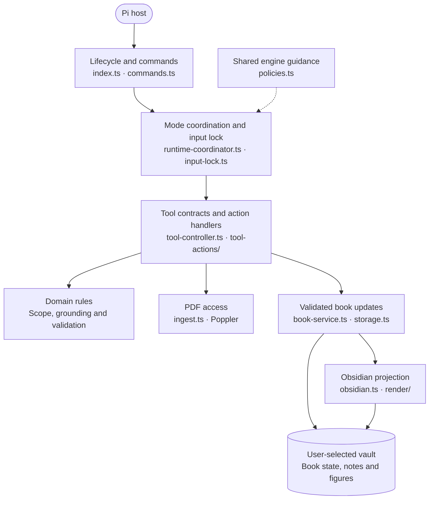

# How Scholar fits together

Scholar is one Pi extension, not three separate agents or services. Learn,
Exam, and Tutor are independent entry points for the same selected PDF book.
You do not have to finish Learn before taking an Exam or opening Tutor.

## The Obsidian hierarchy

The [README diagram](../README.md#your-learning-workspace) shows the visible
note hierarchy. Its editable Mermaid source is [hierarchy.mmd](hierarchy.mmd).
These are logical note relationships, not an extra set of folders to create.

- **Scholar Home** links the books in the selected vault.
- **Each book's actual title** is its hub: chapter notes, exams, and tutoring
  sessions link to that book.
- **Learn** keeps lessons, exact source figures, progress, and understanding
  checks in subsection notes beneath their chapters. Interactive answers are
  entered in Pi.
- **Exam** holds a complete paper answered in Obsidian. Explicit submission
  freezes the responses; grading produces the answer key and topic breakdown.
- **Tutor** keeps its own explanations, source figures, and practice record.
  Interactive answers are entered in Pi, as in Learn.

The modes share the PDF and its validated outline, not each other's learner
history. A Tutor answer does not change Learn progress, and Exam generation
does not use Learn or Tutor performance to alter the test.

## Code boundaries

Explicit lesson delivery uses `lesson.ts` and `lesson-figures.ts`. `notes.lesson`
saves instructional Markdown once in the visible section or Tutor note; its small
receipt associates that text with objectives, key points and source pages. Stable
entry IDs prevent duplicate retries. IDs of deleted entries remain in the same
note's details solely to reject stale retries; they contain no lesson text.
An intentional revision first reads `status` with `lessonId`, then supplies the
current `expectedContentHash`. User edits cannot be overwritten by a stale save.

Learn's `lessonComplete` commit fingerprints the saved explanation and objective
check plan. Editing or deleting its explanation invalidates readiness for new
confirmation questions. Both question formats use this gate. Source inspection
and source-figure files are checked on commitment; this step does not award mastery.
The per-objective checks require evidence for that objective and kind, rather than
borrowing a passing conceptual answer from another topic. One mastery MCQ targets
one objective; integrated open questions may assess several with explicit evidence.

`open-assessment.ts` binds a response to the current book, mode, question, scoring
contract and input turn. Typed evidence must occur in the actual response; image
references must name an attached image. These checks cannot judge whether a quote
or drawing demonstrates the claimed concept. The model evaluates that meaning.
Raw responses, attachment bytes and evidence excerpts are not copied into Scholar
notes. Only the submission fingerprint, criterion outcomes and derived feedback
are retained. On restart, unanswered questions resume; an ungraded answer must be
submitted again. Exam continues to use its own explicit submission and frozen form.

Prompt policies are authoring guidance. Code verifies state, source scope, saved
content, references and response binding; a real generated lesson still needs
review for accuracy, understandable terminology and connected reasoning.

The arrows summarize responsibilities rather than every import or event.
There is deliberately one definition of each engine:

| Shared policy | Learn | Exam | Tutor |
| --- | --- | --- | --- |
| Teaching Engine | Yes | No | Yes |
| Question Engine | Yes | Yes | Yes |

`modes.ts` defines capabilities, `types.ts` defines shared contracts, and
`state-schema.ts` validates persisted records. Durable-history checks and
revision checks protect committed work. `note-storage.ts` reloads the visible records before each operation.
Conversation history cannot restore deleted note content. Pi startup leaves
Scholar closed. Its inactive hooks do not access the vault or replace the editor.
An inactive Pi-session marker closes any old study transcript segment on resume.

## Where information lives

Both paths start blank and must be explicitly configured.

| Location | Responsibility |
| --- | --- |
| User-selected PDF library | Original PDF files; not a progress database |
| User-selected Obsidian vault | All durable Scholar book state, lessons, exams, tutoring records, notes and captured figures |
| Book, section, Tutor and Exam Markdown notes | Authoritative study records with inspectable same-note details |
| `Scholar/Scholar Settings.md` | Visible vault settings and source catalog |
| Local Scholar configuration | Pointer to the chosen vault, not a second book database |
| Pi process memory | Temporary active mode, input locks and pending work |

Pi's own chat/session storage is host-managed and separate from Scholar's book
authority. Deleting a book's workspace from the vault means it no longer exists
to Scholar. Opening its PDF again starts a fresh import; switching vaults does
not copy learning history.

## Source-only repository

This repository contains implementation, CSS, documentation and synthetic tests.
It must not contain PDFs, personal vaults, exam responses, credentials, session
logs, dependencies or machine-specific configuration. Runtime use adds no npm
dependencies; developer tests have their own pinned dependency.

Public redistribution is not yet cleared; see
[THIRD_PARTY_NOTICES.md](../THIRD_PARTY_NOTICES.md). The diagram documents the
current system, not a claim of cross-platform validation or release readiness.
